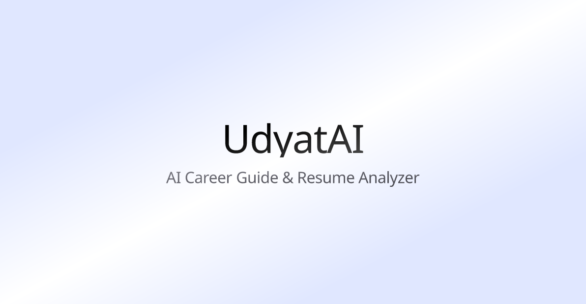

# UdyatAI: Your AI Career Guide & Resume Analyzer


[](https://nextjs.org/)
[](https://react.dev/)

<!-- [](https://zustand-demo.pmnd.rs/) -->

[](https://ai.google.dev/models/gemini)

UdyatAI is an intelligent, AI-powered platform designed to elevate your career by providing in-depth resume analysis and tailored cover letter generation. It acts as your personal career strategy assistant, helping you optimize your job application materials and gain valuable insights into your professional profile.



## ✨ Features

- **📄 AI-Powered Resume Analysis**: Upload your PDF resume and get a comprehensive breakdown of your profile, including candidate name, summary, skills, experience, education, and key highlights.
- **📊 Intelligent Skill Breakdown**: Visualizes your skills with emphasis percentages and detailed reasons, helping you understand how your abilities are perceived.
- **💡 Actionable Improvement Suggestions**: Receive personalized recommendations to enhance your resume's content, formatting, and keyword optimization for target roles.
- **✍️ Tailored Cover Letter Generation**: Generate professional and enthusiastic cover letter drafts instantly, customized based on your analyzed resume and specific job descriptions.
- **⚡️ Modern & Intuitive UI**: Built with a responsive and user-friendly interface for a seamless experience.
- **☁️ Cloud-Ready**: Designed for easy deployment on modern cloud platforms.

## 🛠️ Tech Stack

- **Frontend**: Next.js, React, Framer Motion (for animations), Chart.js (for data visualization)
- **State Management**: Zustand
- **Backend**: Node.js (Next.js API Routes)
- **AI Engine**: Google Gemini (via `@google/genai`)
- **PDF Parsing**: `pdf2json`
- **Styling**: Tailwind CSS

## 🚀 Getting Started

Follow these instructions to get a copy of the project up and running on your local machine for development and testing purposes.

### Prerequisites

- Node.js (v18.x or later recommended)
- npm or yarn
- A Google Cloud Project with the Gemini API enabled and an API Key.

### Installation

1.  **Clone the repository:**

    ```sh
    https://github.com/balajiudayagiri/UdyatAI.git
    cd udyatai
    ```

2.  **Install dependencies:**

    ```sh
    npm install

    ```

3.  **Set up environment variables:**

    Create a `.env` file in the root of the project and add your Google Gemini API Key:

    ```env
    # .env

    GOOGLE_AI_KEY=YOUR_GOOGLE_GEMINI_API_KEY

    # You might also need to configure Google OAuth credentials if authentication is implemented
    # GOOGLE_CLIENT_ID=your_google_client_id
    # GOOGLE_CLIENT_SECRET=your_google_client_secret
    # GOOGLE_REDIRECT_URI=http://localhost:3000/auth/google/callback
    ```

    Replace `YOUR_GOOGLE_GEMINI_API_KEY` with your actual API key.

4.  **Run the development server:**

    ```sh
    npm run dev
   
    ```

    The application should now be running on `http://localhost:3000`.

## 📖 Usage

Once the application is running:

1.  Navigate to the dashboard (usually `http://localhost:3000`).
2.  Upload your resume in PDF format.
3.  Review the AI-generated analysis, including skill breakdown, experience, education, and improvement suggestions.
4.  Optionally, provide job details (company, role, job description) to generate a tailored cover letter draft.

## 🤝 Contributing

Contributions, issues, and feature requests are welcome! Feel free to check the issues page.

To contribute:

1.  Fork the Project
2.  Create your Feature Branch (`git checkout -b feature/AmazingFeature`)
3.  Commit your Changes (`git commit -m 'Add some AmazingFeature'`)
4.  Push to the Branch (`git push origin feature/AmazingFeature`)
5.  Open a Pull Request

Please read `CONTRIBUTING.md` (if available) for details on our code of conduct, and the process for submitting pull requests to us.

## 📝 License

This project is licensed under the MIT License - see the LICENSE.md file for details.

## 🙏 Acknowledgements

- Google Gemini for the powerful AI capabilities.
- pdf2json for PDF parsing.
- Zustand for state management.
- Framer Motion for animations.
- Chart.js for data visualization.
